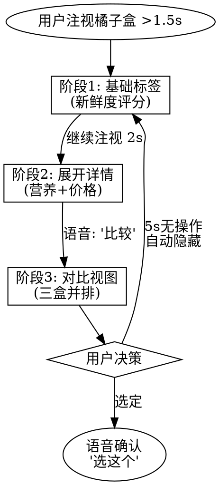

# A2UI 智能眼镜扩展协议

**日期**: 2026-01-20
**基于**: Google A2UI v1.0
**场景**: 超市橘子购物辅助

---

## 1. 协议扩展设计

### 1.1 核心扩展字段

在 A2UI 标准协议基础上，为智能眼镜场景添加以下扩展：

```json
{
  "type": "surfaceUpdate",
  "surfaceId": "orange-comparison-overlay",
  "components": [
    {
      "id": "comp-1",
      "type": "ar.label",
      "properties": {
        // === A2UI 标准字段 ===
        "text": "新鲜度: 8.5/10",
        "style": {
          "color": "#00FF00",
          "fontSize": "18sp",
          "backgroundColor": "transparent"
        },

        // === 智能眼镜扩展字段 ===
        "spatial": {
          "anchorType": "object",           // 锚定类型: object | world | screen
          "objectId": "orange-box-1",       // 物理对象 ID (来自视觉检测)
          "position": {
            "x": 0.1,                       // 相对锚点偏移 (米)
            "y": 0.05,
            "z": 0
          },
          "billboarding": true              // 始终面向用户
        },

        "attention": {
          "trigger": "gaze",                // 触发方式: gaze | voice | auto
          "gazeDuration": 1.5,              // 注视多久后显示 (秒)
          "priority": "medium",             // 优先级: low | medium | high | critical
          "autoHide": 5.0,                  // 无交互自动隐藏 (秒)
          "dndAware": true                  // 遵守免打扰模式
        },

        "interaction": {
          "supportedInputs": ["gaze", "voice", "airTap"],
          "voiceCommands": ["详细信息", "比较", "忽略"]
        }
      }
    }
  ]
}
```

### 1.2 新增组件类型

| 组件类型 | 说明 | 适用场景 |
|---------|------|---------|
| `ar.label` | AR 空间标签 | 物体识别、价格标注 |
| `ar.arrow` | 方向指示箭头 | 导航、物品定位 |
| `ar.comparisonCard` | 并排对比卡片 | 商品比较 |
| `ar.minimalTimer` | 极简计时器 | 烹饪、专注模式 |
| `ar.progressRing` | 环形进度条 | 长期任务追踪 |
| `ar.contextMenu` | 上下文菜单 | 多选项决策 |

---

## 2. 超市橘子场景 UI 设计

### 2.1 场景描述

**用户状态**:
- 站在超市水果区，面前有 3 盒橘子
- 正在比较新鲜度、价格、营养价值
- 手持购物篮，有 15 秒决策时间

**检测到的物体**:
1. 橘子盒 A - 左侧，¥12.8，300g
2. 橘子盒 B - 中间，¥15.9，400g
3. 橘子盒 C - 右侧，¥18.5，500g

**用户已接受的 AI 推荐** (来自数据集):
1. "这些橙子中哪一盒看起来更显新鲜？" (decision_support)
2. "这个橙子品种的维生素 C 含量是多少？" (object_identification)
3. "切好的水果和整颗的橙子相比，哪个性价比更高？" (computation)

### 2.2 UI 渐进式展示



### 2.3 完整 UI JSON 定义

#### 阶段1: 基础标签 (初次注视触发)

```json
{
  "type": "surfaceUpdate",
  "surfaceId": "orange-initial-labels",
  "components": [
    {
      "id": "label-box-a",
      "type": "ar.label",
      "properties": {
        "text": "🍊 新鲜度 8.5",
        "style": {
          "color": "#00FF00",
          "fontSize": "16sp",
          "fontWeight": "bold",
          "backgroundColor": "rgba(0,0,0,0.6)",
          "padding": "4dp",
          "borderRadius": "4dp"
        },
        "spatial": {
          "anchorType": "object",
          "objectId": "orange-box-a",
          "position": {"x": 0, "y": 0.08, "z": 0},
          "billboarding": true
        },
        "attention": {
          "trigger": "gaze",
          "gazeDuration": 1.5,
          "priority": "medium",
          "autoHide": 5.0
        }
      }
    },
    {
      "id": "label-box-b",
      "type": "ar.label",
      "properties": {
        "text": "🍊 新鲜度 9.2",
        "style": {
          "color": "#00FF00",
          "fontSize": "16sp",
          "fontWeight": "bold"
        },
        "spatial": {
          "anchorType": "object",
          "objectId": "orange-box-b",
          "position": {"x": 0, "y": 0.08, "z": 0}
        },
        "attention": {
          "trigger": "gaze",
          "gazeDuration": 1.5,
          "priority": "high",
          "highlight": true
        }
      }
    },
    {
      "id": "label-box-c",
      "type": "ar.label",
      "properties": {
        "text": "🍊 新鲜度 7.8",
        "style": {
          "color": "#00FF00",
          "fontSize": "16sp"
        },
        "spatial": {
          "anchorType": "object",
          "objectId": "orange-box-c",
          "position": {"x": 0, "y": 0.08, "z": 0}
        }
      }
    }
  ]
}
```

#### 阶段2: 展开详情 (持续注视或语音"详细")

```json
{
  "type": "surfaceUpdate",
  "surfaceId": "orange-detail-card",
  "components": [
    {
      "id": "detail-card-b",
      "type": "ar.comparisonCard",
      "properties": {
        "title": "橘子盒 B - 推荐",
        "sections": [
          {
            "label": "新鲜度",
            "value": "9.2/10",
            "icon": "✓",
            "highlight": true
          },
          {
            "label": "价格",
            "value": "¥15.9 (400g)",
            "detail": "单价 ¥39.8/kg"
          },
          {
            "label": "维生素C",
            "value": "53mg/100g",
            "detail": "满足日需 60%"
          },
          {
            "label": "产地",
            "value": "江西赣州",
            "detail": "今日到货"
          }
        ],
        "actions": [
          {
            "label": "加入购物篮",
            "voiceCommand": "选这个",
            "iconGesture": "airTap"
          },
          {
            "label": "查看营养标签",
            "voiceCommand": "看标签"
          }
        ],
        "style": {
          "maxWidth": "280dp",
          "backgroundColor": "rgba(0,20,0,0.85)",
          "textColor": "#00FF00",
          "borderColor": "#00FF00",
          "borderWidth": "1dp"
        },
        "spatial": {
          "anchorType": "object",
          "objectId": "orange-box-b",
          "position": {"x": 0.15, "y": 0, "z": 0},
          "billboarding": true
        },
        "attention": {
          "trigger": "gaze",
          "gazeDuration": 2.0,
          "autoHide": 10.0,
          "priority": "high"
        }
      }
    }
  ]
}
```

#### 阶段3: 三盒对比视图 (语音"比较")

```json
{
  "type": "surfaceUpdate",
  "surfaceId": "orange-comparison-view",
  "components": [
    {
      "id": "comparison-table",
      "type": "ar.comparisonCard",
      "properties": {
        "layout": "horizontal-comparison",
        "items": [
          {
            "id": "box-a",
            "label": "盒 A",
            "metrics": {
              "新鲜度": {"value": 8.5, "unit": "/10"},
              "单价": {"value": 42.7, "unit": "¥/kg"},
              "维C": {"value": 48, "unit": "mg/100g"}
            },
            "highlight": false
          },
          {
            "id": "box-b",
            "label": "盒 B ⭐",
            "metrics": {
              "新鲜度": {"value": 9.2, "unit": "/10"},
              "单价": {"value": 39.8, "unit": "¥/kg"},
              "维C": {"value": 53, "unit": "mg/100g"}
            },
            "highlight": true,
            "badge": "推荐"
          },
          {
            "id": "box-c",
            "label": "盒 C",
            "metrics": {
              "新鲜度": {"value": 7.8, "unit": "/10"},
              "单价": {"value": 37.0, "unit": "¥/kg"},
              "维C": {"value": 45, "unit": "mg/100g"}
            },
            "highlight": false
          }
        ],
        "summary": "盒B 综合最优: 新鲜度高且性价比适中",
        "style": {
          "layout": "table",
          "columnWidth": "90dp",
          "backgroundColor": "rgba(0,20,0,0.9)",
          "highlightColor": "#00FF00"
        },
        "spatial": {
          "anchorType": "screen",
          "position": {"x": 0.5, "y": 0.3, "z": 0},
          "screenRelative": true
        },
        "attention": {
          "priority": "critical",
          "autoHide": 15.0
        },
        "interaction": {
          "voiceCommands": [
            "选 A", "选 B", "选 C",
            "关闭", "返回"
          ]
        }
      }
    }
  ]
}
```

---

## 3. 注意力管理机制

### 3.1 免打扰规则

```json
{
  "type": "contextUpdate",
  "context": {
    "scene": "supermarket_shopping",
    "userActivity": "comparing_products",
    "dndMode": false,
    "dndTriggers": [
      {
        "condition": "user_talking_to_staff",
        "action": "hide_all_ui"
      },
      {
        "condition": "walking_fast",
        "action": "show_minimal_only"
      },
      {
        "condition": "checkout_queue",
        "action": "pause_recommendations"
      }
    ]
  }
}
```

### 3.2 优先级映射

| 场景 | 优先级 | 行为 |
|------|--------|------|
| 用户主动询问 | Critical | 立即显示，覆盖 DND |
| 产品比较 | High | 注视触发，自动隐藏 |
| 营养建议 | Medium | 延迟显示，可跳过 |
| 促销推荐 | Low | 仅在空闲时显示 |

---

## 4. 交互流程示例

### 用户旅程

```
[1] 用户走到橘子货架前
    ↓ (视觉检测到 3 盒橘子)
    → 无 UI 显示 (等待用户注视)

[2] 用户注视中间的盒 B (1.5 秒)
    ↓ (触发 gaze trigger)
    → 显示 "🍊 新鲜度 9.2" 标签

[3] 用户继续注视 (累计 3.5 秒)
    ↓ (gazeDuration 达到 2.0s 阈值)
    → 展开详细卡片 (新鲜度、价格、维C、产地)

[4] 用户说 "比较"
    ↓ (语音命令匹配)
    → 切换到三盒对比表格视图

[5] 用户说 "选 B"
    ↓ (确认选择)
    → 显示 "✓ 已加入购物篮" 提示 (2秒后消失)
    → 所有 UI 隐藏

[6] 用户转向查看苹果
    ↓ (注视离开橘子区域)
    → 橘子 UI 自动隐藏 (5秒后)
```

---

## 5. 性能优化

### 5.1 渲染优化

| 优化项 | 策略 |
|--------|------|
| 组件数量 | 单屏最多 5 个 AR 组件 |
| 文本长度 | 单个标签 ≤ 15 字符 |
| 刷新频率 | 物体追踪 30fps，UI 更新 10fps |
| 距离剔除 | 用户距离 >3m 自动隐藏 |

### 5.2 LLM 生成提示

```
You are generating UI for smart glasses using A2UI protocol.

Context:
- User is at supermarket, looking at 3 boxes of oranges
- User accepted recommendations: freshness comparison, vitamin C content, price calculation

Generate a JSON response with:
1. ar.label components anchored to each orange box
2. Freshness scores: Box A (8.5), Box B (9.2), Box C (7.8)
3. Use green text (#00FF00) on transparent background
4. Gaze trigger with 1.5s duration
5. Auto-hide after 5s of no interaction

Follow A2UI schema with spatial/attention extensions.
```

---

## 6. 与 Google GenUI 的对比

| 维度 | Google GenUI (Web) | A2UI SmartGlasses Extension |
|------|-------------------|----------------------------|
| 输出格式 | HTML + React Components | JSON with AR components |
| 锚定方式 | DOM 元素 | 3D 物理对象 |
| 触发方式 | 用户点击 | 注视 + 语音 + 手势 |
| 信息密度 | 富文本、图片、表格 | 极简文字 + 图标 |
| 显示持久性 | 持续显示 | 自动隐藏 (5-15s) |
| 注意力感知 | 无 | 免打扰模式 + 优先级 |

---

## 7. 实现路线图

### Phase 1: 协议定义 (2 周)
- [ ] 完成 spatial/attention 字段规范
- [ ] 定义 6 种 AR 组件接口
- [ ] 编写协议文档和示例

### Phase 2: Renderer 开发 (4 周)
- [ ] 基于 Unity AR Foundation 实现 SmartGlasses Renderer
- [ ] 支持 ar.label, ar.comparisonCard
- [ ] 集成注视检测 (Tobii Eye Tracker)

### Phase 3: Agent 适配 (2 周)
- [ ] 修改 A2UI Agent SDK 支持新字段
- [ ] 添加 LLM Prompt 模板
- [ ] 测试橘子场景生成

### Phase 4: 数据集验证 (2 周)
- [ ] 使用 P1_YuePan 数据集测试
- [ ] 对比用户接受率
- [ ] 迭代优化

---

## 参考资料

- [A2UI GitHub](https://github.com/google/A2UI)
- [Google Generative UI 论文](https://arxiv.org/abs/2410.08394)
- P1_YuePan 数据集 (内部)
- Unity AR Foundation 文档

---

*生成时间: 2026-01-20*
*作者: Claude (基于 A2UI 协议扩展)*
