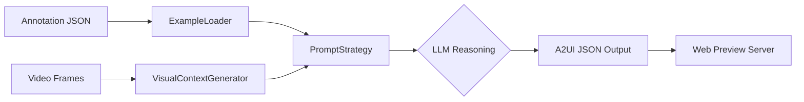

# Generative UI Pipeline: 最小工作流示例

本文档展示了从原始标注数据输入，经过端到端 Pipeline 处理，到最终 A2UI JSON 输出及预览的完整工作流程。

---

## 0. 流程总览 (Workflow Overview)



---

## 1. 输入 (Input)
我们以 `Task2.2` 购物场景中的一个样本 (`sample_035`) 为例。

### 1.1 原始标注 (`rawdata.json`)
由人类标注员定义的用户意图和场景上下文。

```json
{
  "sample_id": "task2.2_p1_035",
  "scene_type": "shopping",
  "annotation": {
    "text": "像这样的三明治加热多久口感最好？",
    "type": "procedural_guidance"
  },
  "scene_context": {
    "location": "清华大学校园",
    "activity": "shopping"
  },
  "video": {
    "frames": ["frame_1.jpg", "frame_2.jpg", "frame_3.jpg"]
  }
}
```

### 1.2 视觉上下文 (Visual Context)
Pipeline 会自动从视频中提取关键帧，并由 VLM 或直接传给多模态 LLM 进行感知。


*(注：此处为示例帧，展示了用户眼前的三明治和微波炉环境)*

---

## 2. 处理步骤 (Processing)

Pipeline 执行以下核心逻辑：

1.  **数据加载 (`ExampleLoader`)**: 解析原始 JSON 和图像路径。
2.  **视觉感知 (`VisualContextGenerator`)**: 提取视觉特征（如“用户手持三明治，面前有微波炉”）。
3.  **生成逻辑 (`PromptStrategy`)**: 
    - 使用 `v3_with_visual` 策略，将文本意图和视觉描述组合成一个复杂的 Prompt。
    - 调用 LLM (如 GPT-4o) 进行推理。
4.  **格式转换与校验**: 将 LLM 生成的原始 UI 结构转换为 A2UI 标准格式，并进行 Schema 校验。

---

## 3. 输出 (Output)

### 3.1 生成的 A2UI JSON
这是最终存储在 `agent/output/` 目录下的结果。

```json
{
  "type": "Card",
  "id": "sandwich_heating_tips_card",
  "props": {
    "variant": "glass",
    "children": [
      {
        "type": "Text",
        "props": {
          "content": "How to heat your sandwich?",
          "variant": "title"
        }
      },
      {
        "type": "Text",
        "props": {
          "content": "For the best taste, heat the sandwich in the microwave for 30 seconds to 1 minute.",
          "variant": "body"
        }
      }
    ]
  },
  "visual_anchor": {
    "type": "object",
    "target": "microwave",
    "reasoning": "微波炉是场景的视觉焦点，且与加热提示直接相关。"
  }
}
```

---

## 4. 预览显示 (Preview)

生成的 JSON 会被加载到预览服务器 (`agent/preview/server.py`)，在浏览器中以 HUD (Heads-Up Display) 风格渲染。

### 4.1 渲染预览
预览器会根据 `visual_anchor` 的信息，将 UI 卡片悬浮在 3D 空间或视频叠加层中。

- **UI 风格**: Glassmorphism (毛玻璃特效)
- **字体**: Rajdhani (科技感等宽字体)
- **交互**: 适配智能眼镜的视线或按钮输入

> **运行预览命令**:
> ```bash
> python -m agent.preview.server --port 8000
> ```
> 访问地址: `http://localhost:8000`
